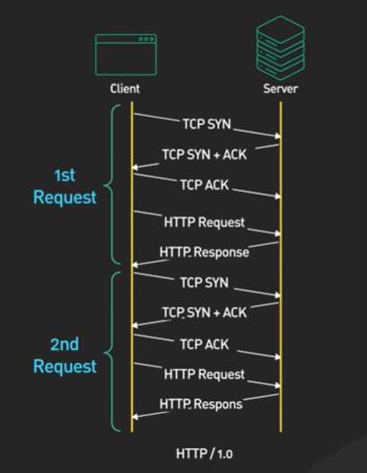
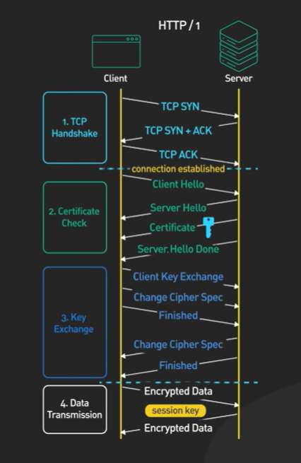
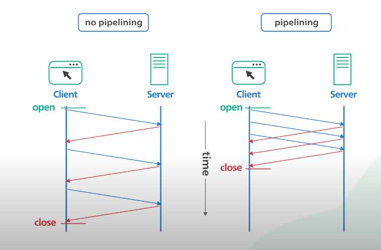
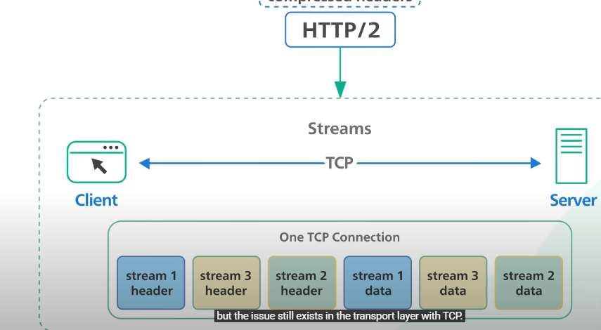
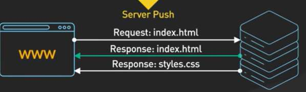
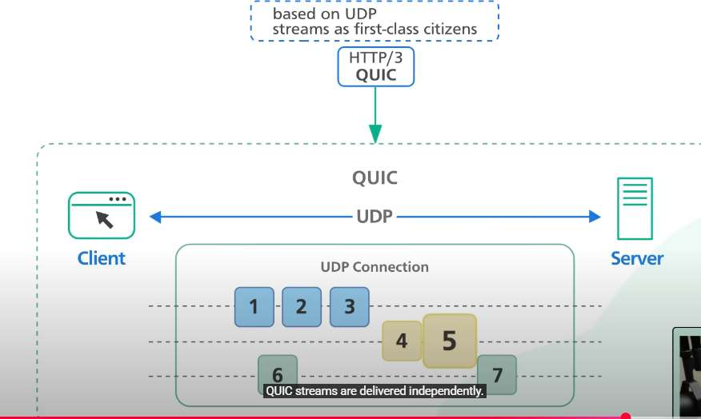

# Networking / Communications

> *09 August 2026*

---

## HTTP — HyperText Transfer Protocol

- HTTP was initially for **hypertext documents** — documents with links to other documents.
- But soon it was used for **images and videos** — and now people use it for **API / file transfer**, etc.

### HTTP/1
- Every request to the same server requires a **separate TCP connection** — meaning again sending **SYN, SYN-ACK, and ACK** packets.



### HTTP/1.1
- Introduced **`Connection: keep-alive`** in the header, so we don't need a separate TCP connection for every request. It **reduced latency**.
- Server closes idle connections after some time automatically (**Nginx — 75 seconds**).
- It also introduced **pipelining** — we can send multiple requests without waiting for a response, in a single TCP connection.
  - This was **removed afterwards** as proxies could not handle it properly. They just use **multiple TCP connections** for performance improvement.





## Head-of-Line (HOL) Blocking
- In HTTP/1.1, **"Head-of-line blocking" (HOL blocking)** occurs when a client's requests over a single TCP connection are held up because the response to the first request is delayed, even if subsequent requests could be processed faster.
- This happens because HTTP/1.1 requires **responses to arrive in the same order as the requests** — if the first request takes a long time to process, it blocks all other requests on that connection.

---

## HTTP/2 — Introduces Streams



- Client can now send **streams of data** which are **independent of each other** in a single TCP connection. It is **split during transmission and put back together** on the other end.
- The server will spin up **different virtual threads** for different requests — which are sent via the **same TCP connection but different stream packets**.
- It also supports a **push mechanism** via which the server can send new data when it is available without requiring the client to poll.
  - **Spring WebFlux** along with **Netty** implements this. Push mechanism also uses streams internally.
  - Server can push **multiple responses**, unlike HTTP/1.1.



### HTTP/2 improvements over HTTP/1.1
- **Multiplexing:** Allows multiple requests and responses to be sent over a single TCP connection, eliminating the head-of-line blocking issue of HTTP/1.1. This internally uses streams.
- **Header Compression (HPACK):** Reduces the size of HTTP headers, leading to lower latency and bandwidth consumption. In HTTP/1.1, it was plain text.
- Because HTTP/2 and HTTP/1.1 run on the **same port (443)**, the client and server must **agree on the protocol before sending any actual HTTP application data** — this negotiation happens during the **TLS handshake**.
- Because HTTP/2 uses a single TCP connection, if a single underlying TCP packet is dropped or delayed on the network, the TCP protocol halts processing for all subsequent packets until the missing packet is retransmitted. This means a single lost packet blocks all active streams on that HTTP/2 connection until TCP recovers. (This TCP-level HOL blocking was later addressed in HTTP/3 by replacing TCP with the QUIC protocol over UDP).

---

## REST Client Configuration

When we create a REST client, we can specify:
1. How many **TCP connections** can be made in parallel.
2. For each TCP connection, how much time it can stay in **queue** before sending to the server. *(It reuses established TCP connections using standard HTTP Keep-Alive to send.)*
3. How much time it can **wait to get a response** from the server.

### Example: 5 Max Connections, 2,000 Requests

**HTTP/1.1 behavior**
- **Requests 1–5:** Acquire the 5 available TCP connections from the pool, issue HTTP requests immediately, and wait for responses.
- **Requests 6–2000:** Sit in the client application's internal wait queue. The calling threads block (or suspend if using asynchronous processing) waiting for a connection to be checked back into the pool.
- **Timeout Risk:** If a queued request waits longer than the client's configured `connectionRequestTimeout` (the lease timeout), the thread unblocks and throws a `ConnectionPoolTimeoutException` or `TimeoutException`.

**HTTP/2 behavior**
- **`SETTINGS_MAX_CONCURRENT_STREAMS` Limit:** Servers enforce a maximum number of concurrent active streams per TCP connection.
- If the server limit is 100 streams per connection, **5 TCP connections can process 500 requests simultaneously** (5 × 100).
- **Requests 1–500** are multiplexed across the 5 connections immediately.
- **Requests 501–2000** enter the client's internal HTTP/2 stream queue.
- As active streams complete and close, queued requests immediately open new streams on the existing TCP connections.

---

## HTTP/3



- *(Not much detail)* Allows connections to **persist even if the client's IP address changes** (e.g., switching from Wi-Fi to cellular). It uses a **connection ID** to identify it — so even after an IP change, we can use the same connection to talk to the server. This is useful in **mobile devices**, etc., where we have internet problems.
- It can have **multiple streams in the same connection** — that's how it solves head-of-line blocking.
- **QUIC is built on top of UDP.**
- HTTP/3 is **faster in setting up a connection** — during handshake, etc.

---

## CORS — Cross-Origin Resource Sharing

- For every domain, **cookies and session tokens are stored in the browser against the domain**.
- A website **cannot read cookies belonging to other domains.** JavaScript code running on your website (`attacker.com`) only has access to cookies that were explicitly set for `attacker.com`. It cannot view, read, or export cookies stored for `yourbank.com`, `google.com`, or any other domain.
- The browser attaches your logged-in session cookie for `yourbank.com` to that request automatically — **earlier; now it's not the case.**
- Whenever a website (`attacker.com`) makes a call to another domain (`yourbank.com`), the browser will attach session cookies and an **origin request header** (`origin: attacker.com`). If the server has **`Access-Control-Allow-Origin: attacker.com`** in the response header, then the browser treats the call as valid and allows `attacker.com` to read the result.
- `access-control-allow-origin` will have **only 1 domain** (same as `origin`) or a regex in response header— it **cannot have a list** of domains.
- For **non-simple requests** (like `PUT`, `DELETE`, or custom JSON headers), the browser sends an HTTP **`OPTIONS` "preflight"** check first. If the target server does not authorize the origin, the actual request is never sent, protecting state-changing actions. Request / response body are both of **size 0**.
- If **scheme** (`http`/`https`), **port** (`443`, `8080`) and **domain** are the same, then it is considered from the same endpoint and **no CORS error**. Additionally, `example.com` and `sub.example.com` are **different domains**.

### Why don't servers pro-actively check the `origin` request header and send a 403 error?
1. The client can be **anything** (curl, mobile device, etc.); the browser is just one of them.
2. **Backward compatibility** — an old server may not be checking origin or sending `Access-Control-Allow-Origin`. Hence no security risk if the browser is proper.
3. A server with new strict code **can** do this strict enforcement.

---

## WebSocket

- WebSocket is a **stateful protocol** that runs **directly on top of TCP** (or TLS/TCP for encrypted `wss://`), **not** on top of HTTP/2.
- It is **duplex, two-way** — meaning anyone can send data.
- Used by **real-time web applications** → stock market, chat apps, gaming.
- First handshake is done by **HTTP** protocal (in the request header it mentions `Upgrade: websocket`); once the handshake is completed, it converts to a **duplex websocket**.
- Anyone can **close the connection** afterwards.
- **WebSockets are hard to scale** because:
  - They are **stateful and persistent**.
  - Unlike normal HTTP requests that open and close quickly, a WebSocket keeps an **open TCP connection for every user**.
  - This forces servers to track **memory, CPU, and network states** for millions of concurrent users at the same time.
  - Even when no data moves, servers must send regular **ping/pong heartbeat signals** to make sure lines are still alive, adding background work.

### If we don't use WebSocket → Polling
- **Short polling** — asking the server, and the server says no, in continuous intervals (say a gap of 5 sec).
- **Long polling** — ask the server; the server holds the connection for a few minutes and then says no or sends all data at once. In continuous intervals.

---

## SSE — Server-Sent Events

- Instead of `application/json`, it uses **`text/event-stream`** as the content type.
- Unlike traditional HTTP, where there is request/response, here it's **Unidirectional Push** (server streams data).
- In standard HTTP, the client sends a request (e.g., `GET /data`), the server returns a complete response, and the connection finishes or goes idle. With SSE, the client sends an initial request, but the server responds with a header set to `Content-Type: text/event-stream`. Instead of closing the connection, the server keeps it open using **HTTP chunked transfer encoding**, streaming new data blocks down to the client as events occur.
- **AI models** (such as OpenAI, Claude, and local LLMs) stream text **token-by-token** rather than waiting for full responses. SSE is the **industry-standard transport protocol for LLM response streaming** due to its low overhead and native text streaming support.
- For **one-way server updates** (e.g., live dashboards, sports scores, price tickers), WebSockets add unnecessary complexity.
- SSE has to be **base-64**; WebSocket can work with binary data — hence payload size increases by **33%**.
- SSE is built directly on top of standard HTTP

### MCP also uses SSE
- **Initial SSE Setup (Server → Client)**
  - The client initiates a single `GET` request to establish the SSE stream.
  - The server keeps this connection open indefinitely.
  - Upon connection, the server immediately emits an **endpoint event** over the SSE stream, providing a target URI (often including a unique session ID, e.g., `/messages?sessionId=xyz`).
- **Incoming Requests (Client → Server)**
  - It opens a **short-lived HTTP POST** request aimed at the assigned session URI.
  - Multiple POST calls for multiple requests.
  - Response in POST call may be ``` {"ok":true}```
- **Response of POST**
  - The server processes the POST request and sends the JSON-RPC response back over the **existing persistent SSE stream** rather than in the HTTP POST response body.
  - Any asynchronous server notifications or logs also travel through this same unified SSE stream.

---

## JSON-RPC

- **JSON-RPC (JSON Remote Procedure Call)** is a lightweight, stateless protocol that allows a client to execute a **function or method on a remote server** and receive the result back.
- Unlike REST, which manipulates resources, it is **action-oriented**.

**Input** *(sent via REST POST)*
```json
{
  "jsonrpc": "2.0",
  "method": "getUserProfile",
  "params": {
    "userId": 42
  },
  "id": 1
}
```
- `jsonrpc`: Must be exactly `"2.0"`.
- `id`: An identifier (string, integer, or null) matching requests to responses.

**Output** *(via SSE)*
```json
{
  "jsonrpc": "2.0",
  "result": {
    "userId": 42,
    "name": "Alice",
    "role": "Admin"
  },
  "id": 1
}
```

**Or** *(batch)*
```json
[
  {
    "jsonrpc": "2.0",
    "method": "add",
    "params": [2, 3],
    "id": 1
  },
  {
    "jsonrpc": "2.0",
    "method": "subtract",
    "params": [10, 4],
    "id": 2
  }
]
```

---

> It can be a **batch response** (response of multiple MCP calls), **notifications** (basically intermediate thinking), **error responses**, etc.
